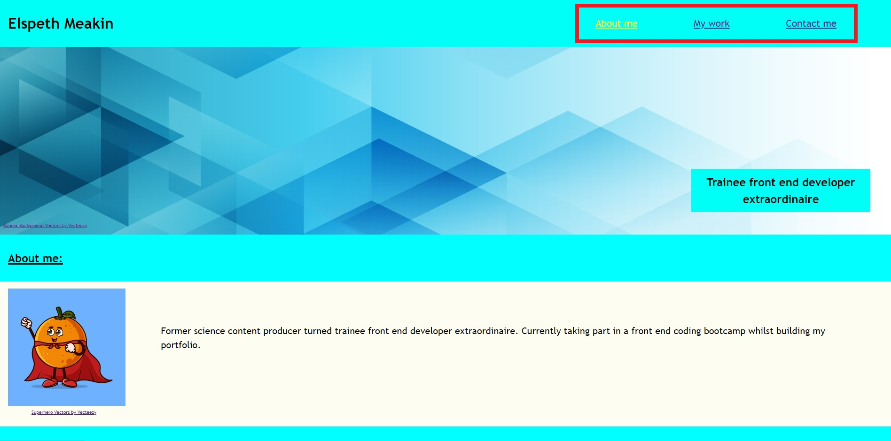
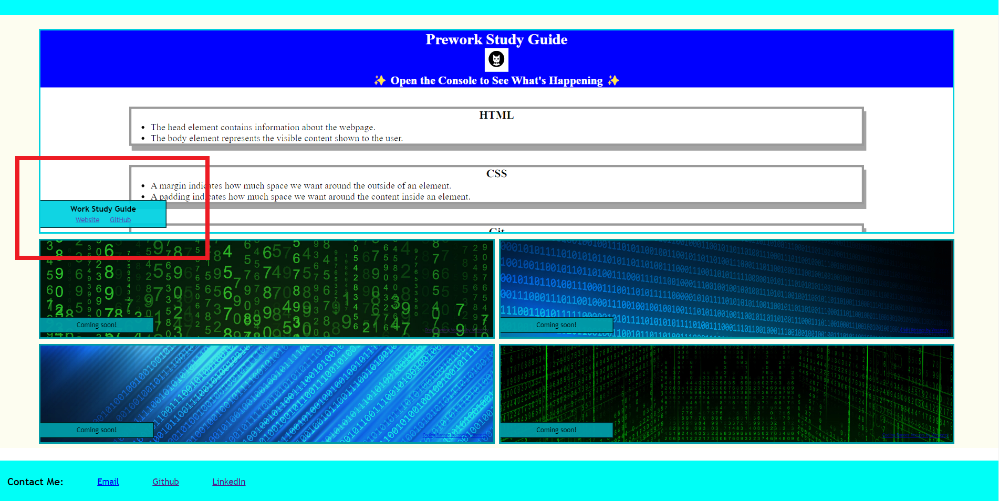
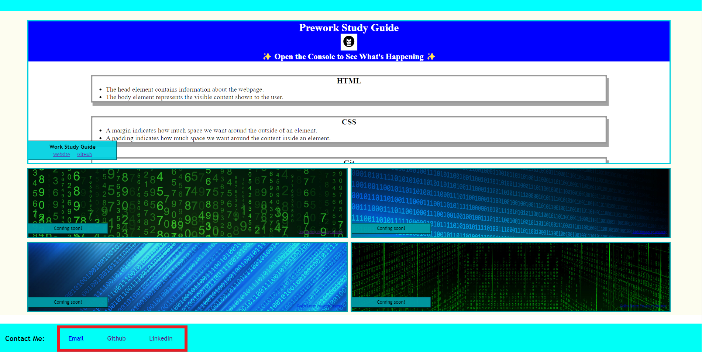

# Elspeth-Meakin-s-Portfolio

## Description

This is a professional portfolio to showcase my past front end development projects, as well as providing my contact information. There will be an image or avatar of myself, and active links to both the website and their respective GitHub repositories. As new projects are completed, they will be added to this webiste, as well as the newest CV. This webiste is also adaptive to different screen sizes.

## Usage

There are links in the header of the website which will go to the corresponding section of the webpage.

There are links in the grid in the "Work" sections which will lead to the work website and GitHub repository.

There are links in the footer of the website which will open the default email application to send an email, to my GitHub profile, and my LinkedIn profile.

## License

MIT
